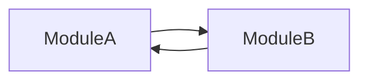

## 🎯 이 문서를 읽고 난 후의 상태

- 순환 참조 문제가 무엇인지 안다.
- 순환 참조 문제를 해결하는 방법을 안다.
- 순환 참조 문제를 예방하는 방법을 안다.

## 😭 문제 상황

[스토리북의 스토리를 작성하다 마주한 순환 참조 문제](/dev-lab/frontEnd/tools/storybook/look-at-storybook)

위의 글에서 확인할 수 있는데, 스토리북에서 스토리를 작성하다가 순환 참조 문제를 마주하게 되었다.<br/>

평소 순환 참조 문제라는 키워드는 들어봤는데, 정작 제대로 알지 못하고 있다는 생각이 들었다.<br/>

그래서 이번 기회에 순환 참조 문제가 무엇인지 확인하고, 이를 해결하는 방법을 알아보려 한다.<br/>

## 🤔 순환 참조 문제란?

`순환 참조(Circular Dependencies)`란 두 개 이상의 모듈이 서로를 직접 또는 간접적으로 참조하는 상황을 의미한다.<br/>

<br/>



<br/>

위의 예시처럼, `ModuleA`와 `ModuleB`가 서로를 참조하는 상황이 발생하면, 이를 순환 참조 문제라고 한다.<br/>

이러한 상황이 발생하면, 모듈이 무한히 서로를 참조하게 되어, 프로그램이 무한 루프에 빠지는 상황이 발생할 수 있으며, 그렇기 때문에 `문제`라고 분류한다.<br/>

보면 알겠지만, 의외로 소프트웨어 개발에서 흔히 발생하는 문제이며, 특히 모듈 간의 의존성이 복잡해지면 복잡해질 수록 발생할 확률이 높아진다.<br/>

코드를 통해 좀 더 살펴보자.<br/>

### 📝 직접 순환 참조 예시

```javascript title="ModuleA.js"
// moduleA.js
import { functionB } from './moduleB.js';

export function functionA() {
  console.log('Function A');
  functionB();
}
```

```javascript title="ModuleB.js"
// moduleB.js
import { functionA } from './moduleA.js';

export function functionB() {
  console.log('Function B');
  functionA();
}
```

위의 코드에서 `ModuleA`와 `ModuleB`가 서로를 참조하고 있다.<br/>

이렇게 되면, `functionA`가 호출되면 `functionB`가 호출되고, `functionB`가 호출되면 `functionA`가 호출되는 무한 루프에 빠지게 된다.<br/>

이러한 상황이 발생하면, 프로그램이 무한 루프에 빠지게 되어, 프로그램이 정상적으로 동작하지 않게 된다.<br/>

### 📝 간접 순환 참조 예시

순환 참조는 두 개 이상의 모듈이 직접 참조하는 것 뿐만 아니라, 간접적으로 참조하는 경우에도 발생할 수 있다.<br/>

```javascript title="ModuleA.js"
// moduleA.js
import { functionC } from './moduleC.js';

export function functionA() {
  console.log('Function A');
  functionC();
}
```

```javascript title="ModuleB.js"
// moduleB.js
import { functionA } from './moduleA.js';

export function functionB() {
  console.log('Function B');
  functionA();
}
```

```javascript title="ModuleC.js"
// moduleC.js
import { functionB } from './moduleB.js';

export function functionC() {
  console.log('Function C');
  functionB();
}
```

위의 코드에서 `ModuleA`는 `ModuleC`를 참조하고, `ModuleC`는 `ModuleB`를 참조하고, `ModuleB`는 `ModuleA`를 참조하고 있다.<br/>

여기서 `moduleA` → `moduleC` → `moduleB` → `moduleA` 순으로 순환 참조가 발생합니다. <br/>

## 🤔 순환 참조는 왜 문제가 되는가?

단순히 무한 루프에 빠지는 것 말고 좀 더 구체적인 이유를 살펴보자.<br/>

|문제|설명|
|---|---|
|**모듈 초기화 문제**|`JavaScript` 모듈 시스템 (특히 ES 모듈)은 모듈을 로드할 때 먼저 의존성을 모두 로드한 후 실행한다.<br/>순환 참조가 있을 경우, 모듈이 완전히 초기화되기 전에 다른 모듈을 참조하게 되어 초기화되지 않은 상태의 값을 참조하게 된다.<br/>이는 `undefined` 또는 예상치 못한 값이 반환되게 만들 수 있다.|
|**메모리 누수**|순환 참조는 `가비지 컬렉션(garbage collection`을 방해할 수 있다.<br/>특히 객체 간 순환 참조는 메모리 누수를 일으킬 수 있다.<br/>가비지 컬렉션은 어떤 변수의 참조 카운트가 0이 될 때 실행이 되는데, 순환 참조가 발생하면 결코 0이 될 수 없기 때문이다.|
|**코드 유지보수의 어려움**|순환 참조는 코드를 이해하고 유지보수하기 어렵게 만든다.<br/>특히 순환 참조가 발생하면, 모듈 간의 의존성이 복잡해지고, 코드를 이해하기 어려워진다.<br/>이는 코드의 재사용성과 확장성을 저해시킨다.|
|**테스트의 어려움**|순환 참조는 테스트하기 어렵게 만든다.<br/>특히 모듈 간의 의존성이 복잡해지면, 테스트 코드를 작성하기 어려워진다.<br/>이게 앞서 말한 스토리북 작성 과정에서 내가 겪은 문제기도 했다.|

## 🤔 순환 참조의 예시와 문제점

간단한 `React` 컴포넌트를 사용하는 예시를 통해서, 순환 참조 문제를 확인해보자.<br/>

```tsx title="ComponentA.tsx"
// ComponentA.tsx
import React from 'react';
import { ComponentB } from './ComponentB';

export const ComponentA: React.FC = () => {
  return (
    <div>
      <h1>Component A</h1>
      <ComponentB />
    </div>
  );
};
```

```tsx title="ComponentB.tsx"
// ComponentB.tsx
import React from 'react';
import { ComponentA } from './ComponentA';

export const ComponentB: React.FC = () => {
  return (
    <div>
      <h1>Component B</h1>
      <ComponentA />
    </div>
  );
};
```

`moduleA` → `moduleB` → `moduleA` → `moduleB` → `moduleA` → `moduleB` → `moduleA` → ... 와 같은 참조가 일어난다.<br/>

그리고 이는 다음과 같은 에러를 발생시킬 수 있다.<br/>

```markdown
Uncaught RangeError: Maximum call stack size exceeded
```

이는 무한 루프가 발생하여 콜 스택이 초과되었기 때문이다.<br/>

## 🤔 순환 참조 문제를 감지하는 방법

사실 제일 좋은 건 의식적으로 매번 점검하면서 넘어가는 것이다.<br/>

다만 그렇게 하면, 생산성이 굉장히 떨어지는 문제가 발생한다.<br/>

매번 하나하나 발생할지 안할지 고려하기엔.. 우리가 해결해야하는 문제와 신경써야할 것들이 너무나도 많다.<br/>

그래서 이러한 문제를 감지하는 도구와 방법을 알아보자.<br/>

### 📝 `ESLint`를 사용한 순환 참조 감지

`ESLint`를 사용하면 순환 참조를 감지할 수 있다.<br/>

`eslint-plugin-import` 플러그인을 사용하면, 순환 참조를 감지할 수 있다.<br/>

```bash
npm install eslint eslint-plugin-import --save-dev
```

그리고 `.eslintrc.js` 파일에 다음과 같이 설정을 추가한다.<br/>

```javascript
module.exports = {
  plugins: ['import'],
  rules: {
    'import/no-cycle': 'error',
  },
};
```

이렇게 설정하면, `ESLint`가 순환 참조를 감지하고, 에러를 발생시킨다.<br/>

사실 인터넷 등에서 찾아서 `ESLint`를 사용하면 항상 `import` 모듈을 다운받아서 쓰곤 했었는데.. 이런 목적으로 쓴다는 걸 이번에 처음알았다... <br/>

역시 항상 뭐든 제대로 알고 넘어가지 않으면 언젠가 피를 보나보다...<br/>

### 📝 `TypeScript`를 사용한 순환 참조 감지

`TypeScript`를 사용하면 순환 참조를 감지할 수 있다.<br/>

`TypeScript`는 기본적으로 순환 참조를 감지하고, 에러를 발생시킨다.<br/>

### 📝 순환 참조 시각화 도구 사용

`madge`와 같은 도구를 사용하면, 코드의 의존성을 시각적으로 보여주어 순환 참조를 쉽게 감지할 수 있다.<br/>

#### 설치
```bash
npm install madge --save-dev
```

#### 순환 참조 탐지

그리고 다음과 같이 명령어를 실행하면, 의존성 그래프를 시각적으로 확인할 수 있다.<br/>

```bash
npx madge --circular src/
```

`src/`는 분석할 소스 디렉토리 경로이다.<br/>

이렇게 하면, 결과로 순환 참조가 있는 파일과 경로를 출력해준다.<br/>

#### 의존성 그래프 시각화

```bash
npx madge --image graph.svg src
```

`graph.svg`는 생성될 그래프 파일 이름이다.<br/>

`src/` 분석할 소스 디렉토리의 경로이다.<br/>

이렇게 하면, `graph.svg` 파일이 생성되어 의존성 그래프를 시각적으로 확인할 수 있다.<br/>

## 🤔 순환 참조 문제 해결 방법

순환 참조를 해결하기 위해서는 모듈 간의 의존성을 재구성하거나, 중간 계층을 도입하여 의존성을 분리해야 한다.<br/>

아래는 일반적인 해결 방법이다.<br/>

|해결 방법|설명|
|---|---|
|**의존성 역전 원칙(DIP) 적용**|의존성 역전 원칙(DIP)은 고수준 모듈이 저수준 모듈에 의존하지 않고, 추상화된 인터페이스에 의존하도록 하는 원칙이다.<br/>이를 통해 모듈 간의 직접적인 의존성을 줄일 수 있다.|
|**의존성 주입(DI) 적용**|의존성 주입(DI)은 의존성을 외부에서 주입받도록 하는 디자인 패턴이다.<br/>이를 통해 모듈 간의 의존성을 외부에서 주입받도록 하여, 순환 참조를 방지할 수 있다.|
|**공통 모듈로 분리**|두 개 이상의 모듈이 서로를 참조할 필요가 없는 공통 기능을 별도의 모듈로 분리하여 의존성을 제거할 수 있다.|
|**동적 임포트(Dynamic Import) 사용**|순환 참조가 필수적일 경우, 동적 임포트를 사용하여 런타임에 모듈을 로드함으로써 초기화 시점의 순환 참조를 피할 수 있다.|
|**의존성 구조 재설계**|근본적인 해결방법이다.<br/>모듈 간의 의존성 구조를 재설계하여 순환 참조가 발생하지 않도록 변경한다.|

## 🧸 실제 사례

앞에서도 언급했지만, 내가 실제로 스토리북의 스토리를 작성하다가 겪은 문제이다.<br/>

이에 대한 해결과정은 아래에서 참고할 수 있다.<br/>

[스토리북 작성 중 발생한 순환 참조 에러 해결하기: Dropdown 컴포넌트 사례 분석](/dev-lab/frontEnd/tools/storybook/circular-dependency-error)

## 📚 정리

- 순환 참조는 두 개 이상의 모듈이 서로를 직접 또는 간접적으로 참조하는 상황을 의미한다.<br/>
- 순환 참조는 모듈 초기화 문제, 메모리 누수, 코드 유지보수의 어려움, 테스트의 어려움 등 다양한 문제를 발생시킨다.<br/>
- 순환 참조를 감지하기 위해서는 `ESLint`, `TypeScript`, `madge`와 같은 도구를 사용할 수 있다.<br/>
- 순환 참조를 해결하기 위해서는 의존성 역전 원칙(DIP), 의존성 주입(DI), 공통 모듈로 분리, 동적 임포트, 의존성 구조 재설계 등의 방법을 사용할 수 있다.<br/>

순환 참조에 대해서 알아보았다.<br/>

네이버 부스트캠프에서나, 전공 수업을 들으면서나 자주 들었던 이야기 중 하나는 `단일 책임 원칙(SRP)`였다. <br/>

여기까지 안가더라도, 의존성을 최대한 낮추는게 좋다는 이야기였다.<br/>

예상치 못한 에러가 많이 생길 수 있고, 유지보수가 어렵다는 측면에서 였다.<br/>

이번에 순환 참조를 알아보면서.. 보다 더 다양한 의미가 함축되어 있음을 느낄 수 있었다.<br/>

뭔가 안다고 생각했는데.. 아직도 많이 부족하다는 생각이 들었다.. 더 열심히 해봐야겠다...<br/>