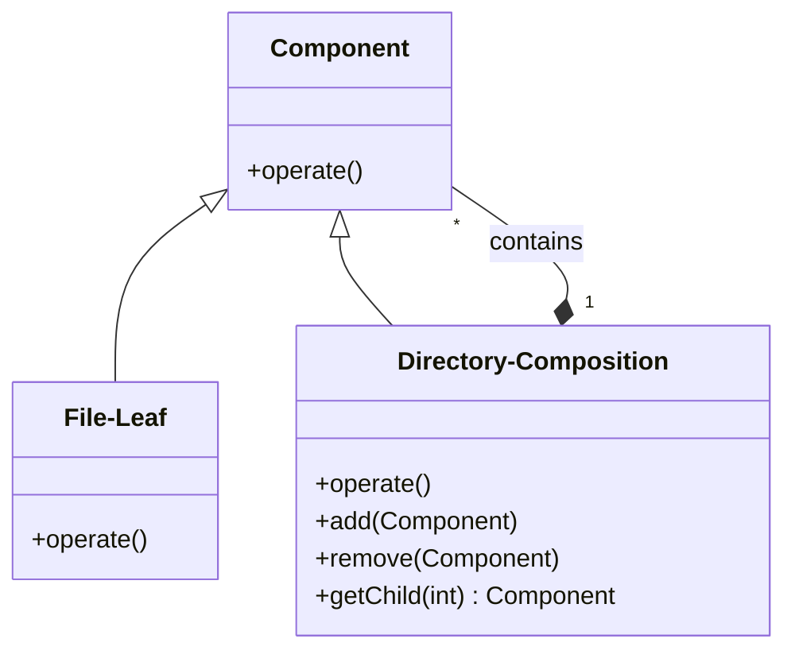

import {Figure} from "@site/src/components/utils/Figure/index";

## 🎯 글을 읽고 났을 때의 상태

- `Composition Pattern`이 뭔지 깨달았다.<br/>
- `Composition Pattern`이 왜 리액트의 핵심 개발 원리인지 이해했다.<br/>
- `Composition Pattern`이 어떻게 리액트에서 활용되는지 파악했다.<br/>

## 🚀 들어가며

어떤 지식을 공부할 때 처음부터 와닿으면 좋겠지만, 뒤늦게 와닿는 경우가 많은 듯 하다.<br/>

나에게 있어서는 `Composition pattern`이 그런 경우였다.<br/>

리액트에서 쓰이는 `합성`이라는 개념의 핵심이기에 자주 접했고, 함수를 바탕으로 한 리액트를 통해 일상적으로 사용했으면서도 크게 와닿지 않았던 것 같다.<br/>

이번에 프로젝트를 진행하면서 몇가지 컴포넌트들을 직접 구현하면서 이 개념의 의미가 💡! 하고 받아들여지게 되었다.<br/>

지금부터 내가 이해했던 개념을 정리할 겸, 정리한번 해보고자 한다. <br/>

## 🤔 Composition pattern이란?

`컴포지션 패턴(Composition Pattern)`은 다른 말로 `합성 패턴`이라고도 부른다.<br/>

`객체지향 프로그래밍(OOP)`과 관련된 `디자인패턴(Design pattern)`의 일종으로, `복합 객체(Composition)`와 `단일 객체(Leaf)`를 동일한 `컴포넌트(Component)`로 취급하여, 클라이언트에게 이 둘을 구분하지 않고 동일한 인터페이스를 바탕으로 사용하게 하는 구조이다. <br/>

설명보다 예시를 먼저 보는게 이해하기 쉬울 듯 하다.<br/>

<Figure fileName='component_composition_pattern_img1.webp' alt='컴포지션 패턴의 하나의 예 : 파일 시스템 구조' caption='컴포지션 패턴의 하나의 예 : 파일 시스템 구조' />

컴포지션 패턴을 이야기할 때면 보통 파일 시스템 구조를 예로 많이 든다.<br/>

파일과 디렉토리 모두 보통 `더블 클릭` 혹은 `열기`를 통해 사용할 수 있다.<br/>

둘은 대상만 다를 뿐이지, 사용하는 사용자 입장에서는 같은 동작을 수행한다.<br/>

이게 바로 컴포지션 패턴이다. <br/>

여기서 복합체 패턴은 파일과 디렉토리를 동일한 인터페이스를 통해서 조작하기 위한게 목적이다. <br/>

<div align="center">



</div>

위와 같은 특징을 갖고 있다. 위 다이어그램을 잘 보면 Component와 Composition(Directory)가 many:1 관계를 갖고 있는 것을 볼 수 있다. <br/>

정리하면 다음과 같다. <br/>

- **Component** : Interface로, Leaf와 Component를 하나로 묶고, 이들이 수행해야 하는 공통 동작을 정의
- **Composition** : 복합 객체, Leaf와 Composition을 내부에 저장하고 관리하는 역할
  - Component 구현체(Leaf, Composition)들을 내부에서 리스트나 객체 등으로 관리
  - add / remove 함수는 내부에서 단일 컴포넌트 구현체들을 저장하거나 삭제하는 역할을 수행
  - operate를 수행시 내부의 리스트를 순회하며, 각 객체들의 operate를 실행
- **Leaf** : 단일 객체, 파일처럼 단순하게 내용물을 표시하는 역할
  - Component의 인터페이스인 operate는 Leaf에서 실행 시 적절한 값을 반환

<br/>

핵심은 `Component` 라는 추상메서드를 정의하고, `Composition`에서 이를 구현하는 구현체들을 배열로 받아서 `재귀(Recursive)`적으로 관리하는 것이다.<br/>

간단하게 정리한 글인데, 이와 관련해서 좀 더 자세하게 설명된 글이 있어서 추가적인 학습이 필요하면 아래의 글을 보면 좋을 것 같다.<br/>

[💠 복합체(Composite) 패턴 - 완벽 마스터하기](https://inpa.tistory.com/entry/GOF-%F0%9F%92%A0-%EB%B3%B5%ED%95%A9%EC%B2%B4Composite-%ED%8C%A8%ED%84%B4-%EC%99%84%EB%B2%BD-%EB%A7%88%EC%8A%A4%ED%84%B0%ED%95%98%EA%B8%B0)<br/>

## 🤔 대표적인 합성 컴포넌트의 사용 예시

앞서, 합성 패턴이란 무엇인지 이해하였다.<br/>

그러면 지금부터 논의를 해봐야하는 것은 과연 프론트앤드에서 어떻게 활용이 되느냐는 것이다.<br/>

이에 대해서는 좀 더 구체적으로 들어가서 모던 리액트에서 어떻게 활용되는지를 이야기하고자 한다. <br/>

최근의 프론트앤드 트렌드에서 리액트는 정말 뺴놓을 수 없는 존재가 되었으므로... 한번 살펴보자. <br/>

## ⚙️ 리액트와 합성 컴포넌트

리액트는 실제로 컴포넌트의 합성을 통해 복잡한 UI/UX를 구현할 수 있도록 설계하고 구현이 되었다.<br/>

이에 대한 근거 자료는 어렵지 않게 찾아 볼 수 있는데, 바로 아래와 같다.<br/>

[합성 (Composition) vs 상속 (Inheritance)](https://ko.legacy.reactjs.org/docs/composition-vs-inheritance.html) <br/>

리액트의 공식문서인데, 애초부터 합성을 권장하고 있음을 알 수 있다.<br/>

[React로 사고하기](https://ko.react.dev/learn/thinking-in-react) <br/>

이는 비교적 최신 문서인데, 여기서도 합성 컴포넌트 방식을 바탕으로 튜토리얼을 진행하는 것을 볼 수 있다.<br/>

## ⚙️ 구체적인 사례

리액트에서 합성 컴포넌트 패턴이 쓰인다는 것도 알았으니, 이제는 좀 더 구체적인 요소를 살펴보자. <br/>

리액트의 설계 및 개발 철학 중 하나이기에, 사례는 정말 많지만 이를 쉽게 이해할 수 있는 사례는 4가지 인 듯 하다.<br/>

1. Render Props
2. Children Props
3. Higher-Order Components (HOC)
4. Compound Components

<br/>

1번은 `class` 문법과 관련해서 이야기하고자 하고, 2, 3, 4번은 `function` 문법에 기반해서 이야기하고자 한다.<br/>

## 🚀 1. Render Props

Render Props는 컴포넌트가 함수 형태의 prop을 통해 렌더링 내용을 제어할 수 있게 하는 패턴이다.<br/>

이를 통해 컴포넌트 간의 로직을 공유할 수 있으며, 이에 따른 예시는 아래와 같다. <br/>

```jsx
// Render Props 컴포넌트
class DataFetcher extends React.Component {
  state = { data: null };

  componentDidMount() {
    // 데이터 fetching 예시
    fetch(this.props.url)
      .then(response => response.json())
      .then(data => this.setState({ data }));
  }

  render() {
    return this.props.render(this.state.data);
  }
}

// 사용 예
const App = () => (
  <DataFetcher
    url="https://api.example.com/data"
    render={(data) => (
      data ? <div>Data: {data.value}</div> : <div>Loading...</div>
    )}
  />
);

```

Render Props 패턴을 사용하여 DataFetcher 컴포넌트가 데이터를 가져오는 로직을 캡슐화한 모습이다. <br/>

```jsx
    render={(data) => (
      data ? <div>Data: {data.value}</div> : <div>Loading...</div>
    )}
```

여기에서 확인할 수 있듯이, 렌더링 방식은 부모가 정의할 수 있게 하는 방법이다. <br/>

클래스 문법이 생소할 수 있겠다는 생각에, 말해보자면 react의 `class` 문법에서는 `render()`가 `function`의 `return`과 같은 역할이다. <br/>

그래서 위 구조를 보면 인자로 받아서, 이를 `render()`에 넣어 랜더링하는 방식을 채택하고 있다.<br/>

즉, `component`의 `operate()`가 `render()`인 셈이라고 생각하면 좋을 듯 하다.<br/>

그리고 만약 위의 기법을 함수형 컴포넌트에서 사용하고 싶으면, 똑같이 `props`에 컴포넌트 생성해서 넘겨주면 된다.<br/>

이에 관한 이야기는 2번에서 하도록 하겠다.<br/>

## 🚀 2. Children Props

리액트 컴포넌트는 `children prop`을 통해 다른 컴포넌트를 포함할 수 있다.<br/>

리액트를 접해봤다면 많이 사용해봤을 방식으로, 이를 통해 부모 컴포넌트가 자식 컴포넌트를 조합하여 복잡한 UI를 구성할 수 있다.<br/>

```jsx
// 부모 컴포넌트
const Card = ({ children }) => {
  return (
    <div className="card">
      {children}
    </div>
  );
};

// 자식 컴포넌트
const CardHeader = ({ title }) => <h2>{title}</h2>;
const CardBody = ({ content }) => <p>{content}</p>;

// 사용 예
const App = () => (
  <Card>
    <CardHeader title="Card Title" />
    <CardBody content="This is the card body." />
  </Card>
);

```

이 예시에서 `Card` 컴포넌트는 `CardHeader`와 `CardBody` 컴포넌트를 포함하여 하나의 카드 UI를 구성한다.<br/>

이를 통해 각 부분을 독립적으로 재사용하고 관리할 수 있게 된다.<br/>

사실 이것도 따지고 보면 1번과 큰 차이가 없다. 구조분해 할당으로 `{children}`으로 표기해서 그렇지 원래는 `props.children`으로 표현해서 사용가능하기 때문이다.<br/>

## 🚀3. Higher-Order Components (HOC)

HOC는 컴포넌트를 인자로 받아 새로운 컴포넌트를 반환하는 함수이다.<br/>

`고차 컴포넌트`라고도 불리는데, JS의 `고차 함수`에서 가져온 방법이다. <br/>

고차 함수는 자바스크립트의 근본 원리이기에.. 이에 대해서는 나중에 따로 다뤄보도록 하겠다.<br/>

어쨌든, HOC을 통해 컴포넌트의 기능을 확장하거나 공통 로직을 재사용할 수 있다.<br/>

```jsx
// HOC 정의
const withLogging = (WrappedComponent) => {
  return (props) => {
    console.log(`Rendering ${WrappedComponent.name}`);
    return <WrappedComponent {...props} />;
  };
};

// 사용 예
const Button = ({ label }) => <button>{label}</button>;
const ButtonWithLogging = withLogging(Button);

// 렌더링 시 콘솔에 로그가 출력됨
<ButtonWithLogging label="Click Me" />
```

사용 예시는 위와 같다. <br/>

HOC를 사용하면 Button 컴포넌트의 기능은 유지한 채로, 로깅 기능을 추가할 수 있으며, 다른 컴포넌트에도 동일한 HOC를 적용할 수 있다. <br/>

이에 대한 활용 기법의 또 다른 예로는 에러 처리가 있다.<br/>

<details>

  <summary> 🚀 에러 처리 HOC 예시</summary>

  ```jsx
  // HOC 정의
  const withErrorBoundary = (WrappedComponent) => {
    return (props) => {
      try {
        return <WrappedComponent {...props} />;
      } catch (error) {
        return <div>Error: {error.message}</div>;
      }
    };
  };

  // 사용 예
  const ErrorComponent = () => {
    throw new Error('Error occurred');
  };
  const ErrorComponentWithBoundary = withErrorBoundary(ErrorComponent);
  ```

  이 예시에서 ErrorComponent는 에러를 발생시키는 컴포넌트이며, ErrorComponentWithBoundary는 에러 처리 HOC를 적용한 컴포넌트이다.<br/> 에러가 발생하면 HOC에서 에러를 처리하고, 에러 메시지를 출력한다.<br/> 이를 통해 컴포넌트의 에러 처리 로직을 재사용할 수 있다.<br/>

</details>

## 🚀 4. Compound Components


Compound Components 패턴은 관련된 여러 컴포넌트를 조합하여 하나의 복합 컴포넌트를 구성하는 방법이다.<br/>

이를 통해 더 직관적이고 선언적인 API를 제공할 수 있다.<br/>

```jsx
// Compound Components 정의
const Tabs = ({ children }) => {
  const [activeIndex, setActiveIndex] = React.useState(0);

  return (
    <div>
      <div className="tab-headers">
        {React.Children.map(children, (child, index) =>
          React.cloneElement(child, {
            isActive: index === activeIndex,
            onClick: () => setActiveIndex(index),
          })
        )}
      </div>
      <div className="tab-content">
        {children[activeIndex].props.children}
      </div>
    </div>
  );
};

const Tab = ({ isActive, onClick, title }) => (
  <button
    className={isActive ? 'active' : ''}
    onClick={onClick}
  >
    {title}
  </button>
);

// 사용 예
const App = () => (
  <Tabs>
    <Tab title="Tab 1">Content of Tab 1</Tab>
    <Tab title="Tab 2">Content of Tab 2</Tab>
    <Tab title="Tab 3">Content of Tab 3</Tab>
  </Tabs>
);
```

이 예시에서 Tabs 컴포넌트는 여러 Tab 컴포넌트를 자식으로 받아 활성화된 탭을 관리하고 렌더링하고 있다.<br/>

이를 통해 탭 UI를 쉽게 구성할 수 있다.<br/>

이와 같이 합성 패턴을 사용할 때의 장점은 다음과 같다.<br/>

- **재사용성 향상**: 컴포넌트를 독립적으로 설계하여 다양한 상황에서 재사용할 수 있다.
- **유연성 증대**: 컴포넌트의 조합 방식을 통해 다양한 UI를 동적으로 구성할 수 있다.
- **유지보수 용이**: 각 컴포넌트가 독립적으로 동작하므로 수정이나 확장이 쉬워진다.
- **가독성 향상**: 컴포넌트의 역할이 명확하게 분리되어 코드의 가독성이 높아진다.

하지만 마냥 좋은 것은 아니다. 다음과 같은 주의사항이 존재한다. <br/>

- **과도한 추상화 피하기**: 합성 패턴을 남용하면 컴포넌트 계층이 지나치게 복잡해질 수 있다. 적절한 수준에서 합성을 사용하는 것이 중요하다.
- **명확한 API 설계**: 컴포넌트 간의 상호작용이 명확해야 한다. 특히 Compound Components를 사용할 때는 부모와 자식 간의 인터페이스를 명확히 정의해야 한다.
- **성능 고려**: 합성 패턴을 사용할 때 불필요한 리렌더링이 발생하지 않도록 최적화가 필요할 수 있다. `React.memo`나 `useCallback` 등을 활용하여 성능을 최적화할 수 있다.


## 📚 마무리

지금까지 `Composition Pattern`이 무엇인지 원리를 파악하고, 이게 리액트에서 어떻게 적용되는지를 살펴보았다.<br/>

앞서 소개한 4가지 사례 말고도, 이 패턴은 정말 빈번하게 사용이 되고 있다.<br/>

조금 더 깊게 들어가서, 소개된 것 외에도 어떤 문제에 이 패턴을 활용해볼 수 있을지를 고민해보면, 본 글에 더해서 추가적인 성장을 이룰 수 있지 않을까 한다.<br/>